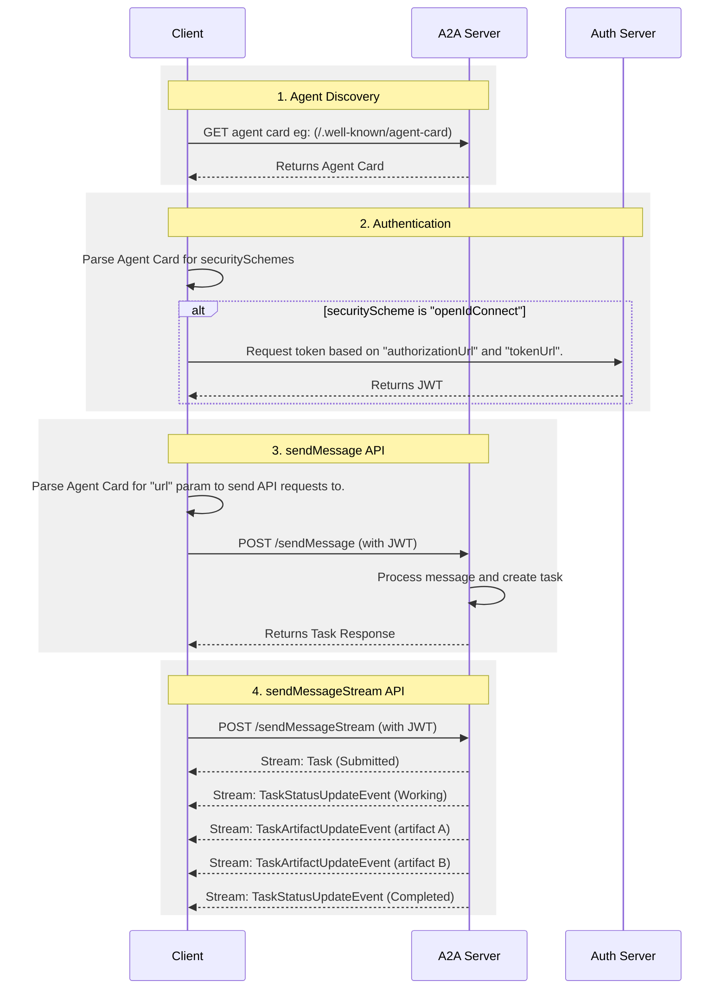

# 什么是 A2A？

A2A（Agent2Agent）协议是一种开放标准，让 AI 智能体之间能无缝通信、一起干活。它给用不同框架、不同厂商做出来的智能体提供一套"通用语言"，促进互操作性，打破孤岛。智能体就是在自己环境里独立做决策、解决问题的角色；A2A 让来自不同开发者、不同框架、不同组织的智能体也能凑到一块儿协作。

---

## 一、为何要用 A2A？

A2A 解决的是 AI 智能体协作里最头疼的那几件事，给智能体之间的交互定了一套标准玩法。下面先说它解决了啥问题，再看一个具体例子。

### A2A 解决了什么问题

假设用户让 AI 助手"规划一次国际旅行"。
这事得协调一堆专用智能体：机票预订、酒店预订、当地旅游推荐、货币兑换等等。

**没有 A2A 的时候**，把这些智能体接在一起会碰到以下问题（与原文顺序一致）：

- **安全缺口（Security Gaps）**：临时拼的通信往往缺乏一致的安全措施。
- **互操作性（Interoperability）**：这种做法限制互操作性，阻碍复杂 AI 生态的有机形成。
- **可扩展性（Scalability Issues）**：智能体和交互一多，系统就难以扩展和维护。
- **创新缓慢（Slow Innovation）**：每个新集成都要定制开发，拖慢创新。
- **定制集成（Custom Integrations）**：每次交互都需要定制、点对点的方案，工程开销大。
- **智能体暴露方式（Agent Exposure）**：大家往往把智能体包装成工具再暴露给别的智能体，类似 MCP（Model Context Protocol）里暴露工具那样。但智能体天生是为直接协商设计的，当工具用就浪费了；A2A 允许智能体以本来面目暴露，无需这种包装。

A2A 协议通过建立智能体之间**可靠、安全**交互的互操作性，来应对上述挑战。

### 一个例子：从"规划旅行"说起

**用户的复杂请求**：用户对 AI 助手说一句"规划一次国际旅行"。

**协作需求**：助手发现光靠自己不行，得叫上机票、酒店、货币、当地旅游等多个专用智能体一起干。

**互操作性挑战**：问题在于——这些智能体各搞各的，没有统一协议，既没法协作，也不知道对方能干啥，等于各自孤岛。

**"使用 A2A"之后**：A2A 协议为智能体提供标准的方法和数据结构，使其彼此通信；不论底层如何实现，同一批智能体都可作为互联系统，通过标准化协议无缝通信。作为编排者的 AI 助手，从所有支持 A2A 的智能体处获得一致的信息，继而将一份完整、统一的旅行计划作为对用户初始提示的无缝响应呈现给用户。

---

## 二、核心优势

用上 A2A 之后，在整个 AI 生态里能拿到这些好处（与原文顺序一致）：

- **支持 LRO（Support for LRO）**：协议支持长时间运行操作（LRO），以及基于 Server-Sent Events（SSE）的流式与异步执行。
- **降低集成复杂度（Reduced integration complexity）**：协议标准化了智能体通信，团队可以专注各自智能体提供的独特价值。
- **智能体自主性（Agent autonomy）**：A2A 让智能体在与其他智能体协作的同时，仍保留自身能力，作为自主实体行动。
- **互操作性（Interoperability）**：A2A 打破不同 AI 智能体生态的孤岛，使不同厂商、不同框架的智能体能够无缝协作。
- **安全协作（Secure collaboration）**：没有标准时，难以保证智能体间通信的安全。A2A 使用 HTTPS 进行安全通信，并保持执行不透明，协作时智能体无法窥探其他智能体的内部运作。

---

## 三、设计原则

A2A 的开发遵循优先考虑广泛采用、企业级能力与面向未来的原则（与原文顺序一致）：

- **不透明执行（Opaque Execution）**：智能体在协作时不暴露内部逻辑、记忆或专有工具，交互依赖声明的能力与交换的上下文，从而保护知识产权并增强安全。
- **模态无关（Modality Independent）**：协议允许智能体使用多种内容类型通信，支持超越纯文本的丰富、灵活交互。
- **异步（Asynchronous）**：A2A 原生支持长时间运行任务，应对智能体或用户可能非持续在线的场景，采用流式、推送通知等机制。
- **企业就绪（Enterprise Readiness）**：A2A 满足关键企业需求，在认证、授权、安全、隐私、追踪与监控方面对齐标准 Web 实践。
- **简洁（Simplicity）**：A2A 基于 HTTP、JSON-RPC、Server-Sent Events（SSE）等现有标准，避免重复造轮子，加速开发者采用。

---

## 四、技术栈：A2A、MCP 与 ADK

A2A 处在更广泛的智能体技术栈中，该栈包括（与原文自底向上顺序一致）：

- **模型（Models）**：智能体推理的基础，可以是任意大语言模型（LLM）。
- **框架（如 ADK）（Frameworks (like ADK)）**：提供构建智能体的工具集。
- **MCP**：将模型与数据、外部资源连接起来。
- **A2A**：标准化部署在不同组织、用不同框架开发的智能体之间的通信。

### A2A 和 MCP 有啥不同

在更广泛的 AI 通信生态中，你可能熟悉旨在促进智能体、模型与工具之间交互的协议。其中，**Model Context Protocol（MCP）** 是一种新兴标准，专注于将大语言模型（LLM）与数据、外部资源连接起来。

**Agent2Agent（A2A）** 协议则用于标准化 AI 智能体之间的通信，尤其是部署在外部系统中的智能体。A2A 与 MCP 互补，针对智能体交互中相关但不同的层面。

- **MCP 的焦点**：降低将智能体与工具、数据连接起来的复杂度；工具通常是无状态的，执行特定、预定义的功能（如计算器、数据库查询）。
- **A2A 的焦点**：让智能体以其原生模态协作，以智能体（或用户）身份通信，而非被约束为工具式交互；从而支持推理、规划、向其他智能体委派任务等复杂多轮交互，例如下单时的协商与澄清。

将智能体封装为简单工具本质上有局限，无法体现智能体的全部能力。

### A2A 和 ADK 啥关系

[Agent Development Kit (ADK)](https://google.github.io/adk-docs) 是 Google 开发的开源智能体开发工具包。A2A 是智能体通信协议，使智能体能够进行跨智能体通信，与其构建所用框架（如 ADK、LangGraph 或 Crew AI）无关。ADK 是灵活、模块化的框架，用于开发和部署 AI 智能体；虽针对 Gemini AI 与 Google 生态优化，但 ADK 与模型、部署方式无关，并致力于与其他框架兼容。

---

## 五、A2A 请求生命周期（A2A Request Lifecycle）

A2A 请求生命周期是一个序列，描述请求所遵循的四个主要步骤：智能体发现（agent discovery）、认证（authentication）、`sendMessage` API 和 `sendMessageStream` API。下图进一步展示操作流程，说明客户端、A2A 服务器与认证服务器之间的交互。

---

**本文出处与版权声明**

- 原文标题：What is A2A?
- 原文来源：A2A Protocol 官方文档  
- 原文链接：https://a2a-protocol.org/latest/topics/what-is-a2a/#the-interoperability-challenge  
- 版权：Copyright 2026 The Linux Foundation. Licensed under the Apache License, Version 2.0.  
- 本文为上述文档的摘录与中文翻译，仅供学习与参考，版权归 The Linux Foundation 及 A2A 项目所有。